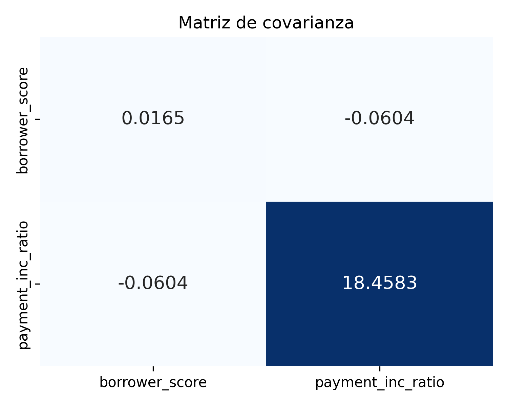
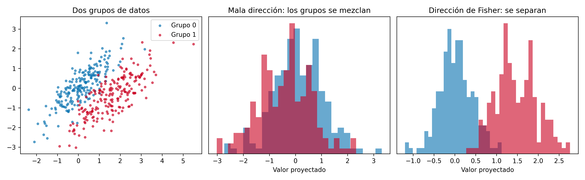
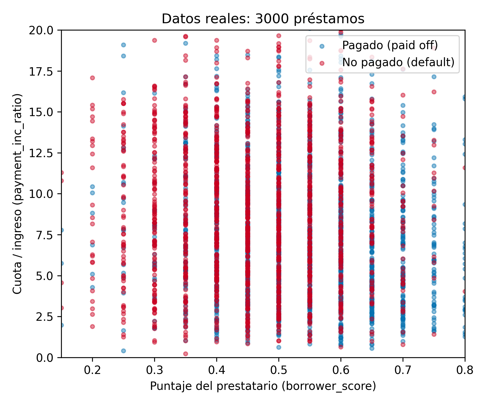
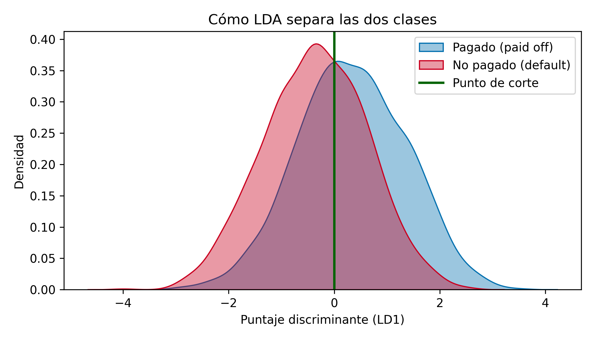
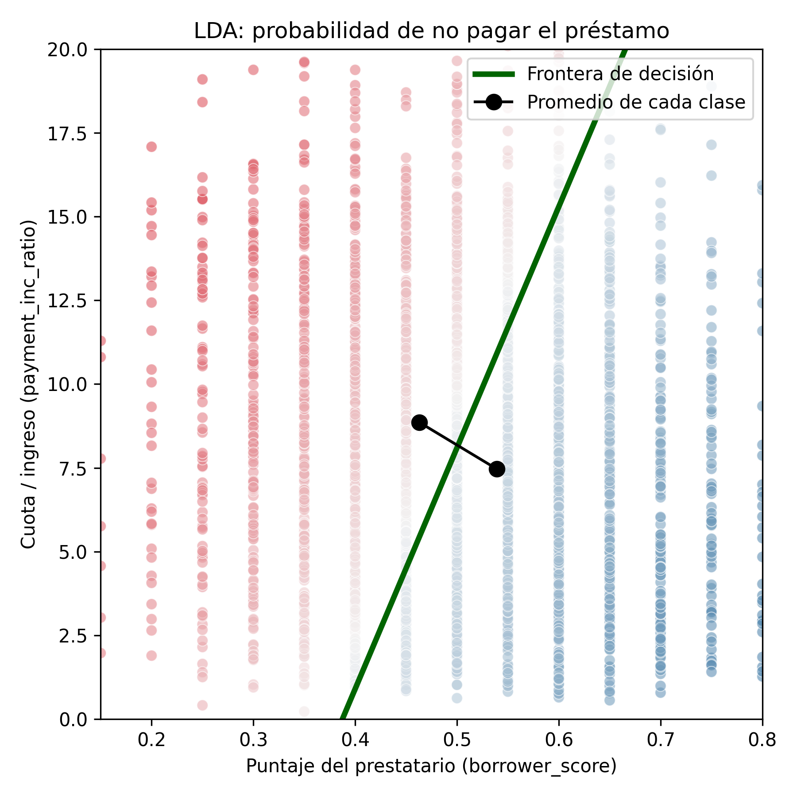
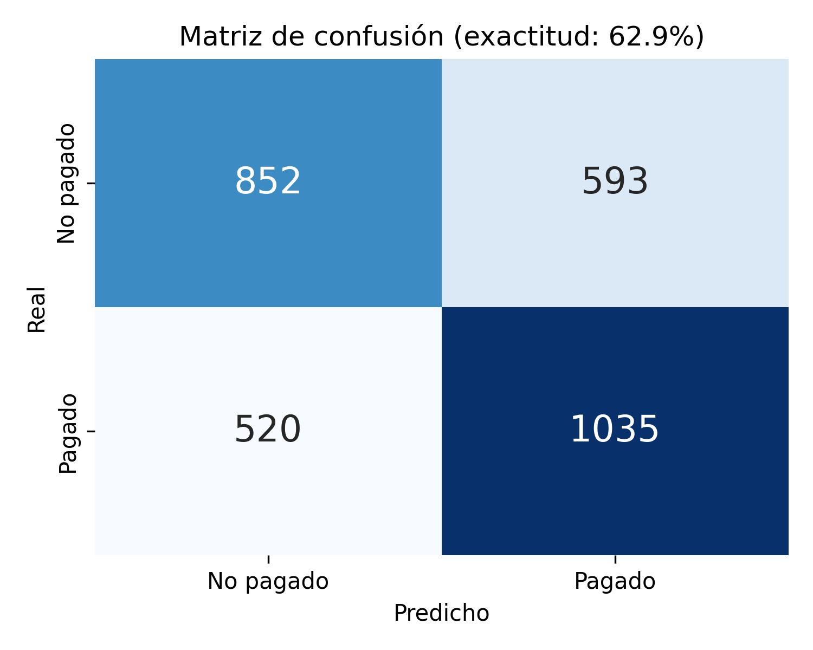
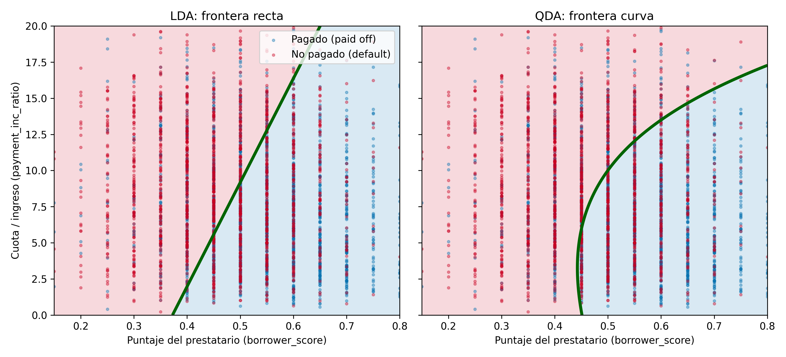

# 2.2 Análisis Discriminante

El análisis discriminante es el clasificador estadístico más antiguo. Fue propuesto por el estadístico R. A. Fisher en 1936, en un artículo publicado en la revista *Annals of Eugenics* (hoy llamada *Annals of Human Genetics*). En ese trabajo, Fisher lo usó para distinguir especies de flores *iris* a partir de las medidas de sus pétalos y sépalos.

Aunque el análisis discriminante abarca varias técnicas, la más usada es el **Análisis Discriminante Lineal**, conocido como **LDA** por sus siglas en inglés (*Linear Discriminant Analysis*). El método original de Fisher era un poco distinto al LDA actual, pero su funcionamiento es esencialmente el mismo.

Hoy el LDA se usa menos, porque han aparecido técnicas más avanzadas como los modelos de árboles y la regresión logística. Sin embargo, todavía se encuentra en algunas aplicaciones y está relacionado con otros métodos muy usados, como el análisis de componentes principales (PCA).

> **Atención:** no se debe confundir el Análisis Discriminante Lineal con la *Latent Dirichlet Allocation*, que también se abrevia LDA. Esta última se usa en el procesamiento de texto y lenguaje natural, y no tiene relación con el método que se explica aquí.

## Términos clave

- **Covarianza:** mide cuánto varía una variable junto con otra, es decir, si se mueven en una dirección y magnitud parecidas.
- **Función discriminante:** es la función que, aplicada a las variables predictoras, maximiza la separación entre las clases.
- **Pesos discriminantes:** son las puntuaciones que resultan de aplicar la función discriminante. Se usan para estimar la probabilidad de que un registro pertenezca a una clase o a otra.

## 2.2.1 La matriz de covarianza

Para entender el análisis discriminante primero hay que conocer la **covarianza**, que mide la relación entre dos variables *x* y *z*. Si llamamos x̄ y z̄ a sus promedios, la covarianza se calcula así:

$$
s_{x,z} = \frac{\sum_{i=1}^{n} (x_i - \bar{x})(z_i - \bar{z})}{n - 1}
$$

donde *n* es el número de registros. Se divide entre *n − 1* y no entre *n* por la misma razón que en la varianza (grados de libertad).

Igual que en la correlación, un valor positivo indica una relación positiva (cuando una variable sube, la otra también tiende a subir) y un valor negativo indica una relación negativa. La diferencia es que la correlación siempre está entre −1 y 1, mientras que la covarianza depende de la escala de las variables.

Con las varianzas y la covarianza se arma la **matriz de covarianza**. En la diagonal van las varianzas de cada variable y fuera de la diagonal, las covarianzas entre ellas:

$$
\hat{\Sigma} = \begin{bmatrix} s_x^2 & s_{x,z} \\ s_{z,x} & s_z^2 \end{bmatrix}
$$

Para los datos de préstamos que se usan en el ejemplo, la matriz es:



*Figura 2.2.1. Matriz de covarianza de las variables del ejemplo. Elaboración propia con datos de Bruce et al. (2020).*

La covarianza entre las dos variables es negativa (−0.0604). Esto indica que las personas con mejor puntaje tienden a tener una cuota un poco menor en relación con su ingreso. Su correlación es −0.11, así que la relación es débil. La figura también muestra por qué la covarianza depende de la escala: la varianza de `payment_inc_ratio` (18.46) es mucho mayor que la de `borrower_score` (0.0165) solo porque sus valores son más grandes.

> **Relación con la distancia de Mahalanobis:** la desviación estándar se usa para estandarizar una variable (puntuación z). La matriz de covarianza permite hacer lo mismo con varias variables a la vez. Esto se conoce como **distancia de Mahalanobis** y está relacionado con la función del LDA.

## 2.2.2 El discriminante lineal de Fisher

Para simplificar, supongamos que queremos predecir un resultado binario *y* (0 o 1) usando solo dos variables numéricas, *x* y *z*.

En teoría, el análisis discriminante supone que las variables predictoras son continuas y siguen una distribución normal. En la práctica, el método funciona bien aunque los datos no sean exactamente normales e incluso con predictores binarios.

La idea de Fisher es distinguir entre dos tipos de variación:

- **Variación entre grupos (SS entre):** es la distancia al cuadrado entre los promedios de los dos grupos. Mientras más grande, más separados están los grupos.
- **Variación dentro de los grupos (SS dentro):** es qué tan dispersos están los datos alrededor del promedio de su propio grupo, ponderada por la matriz de covarianza. Mientras más pequeña, más compacto es cada grupo.

El método busca la combinación lineal de las variables, *w<sub>x</sub>·x + w<sub>z</sub>·z*, que hace lo más grande posible este cociente:

$$
\frac{SS_{\text{entre}}}{SS_{\text{dentro}}}
$$

Al hacer grande la variación entre grupos y pequeña la variación dentro de cada grupo, se logra la mayor separación posible entre las dos clases.

La siguiente figura muestra esta idea con datos simulados. Si proyectamos los datos en una dirección cualquiera, los grupos se mezclan. Si los proyectamos en la dirección que encuentra Fisher, los grupos quedan claramente separados.



*Figura 2.2.2. Proyección de dos grupos simulados en una dirección cualquiera (centro) y en la dirección de Fisher (derecha). Elaboración propia.*

## 2.2.3 Ejemplo práctico

Para el ejemplo se usa el conjunto de datos `loan3000` del libro, con 3000 préstamos personales. La variable que queremos predecir es `outcome`, que indica si el préstamo fue pagado (`paid off`, 1555 casos) o no fue pagado (`default`, 1445 casos). Como predictores se usan:

- `borrower_score`: puntaje entre 0 y 1 que indica qué tan confiable es el prestatario (de malo a excelente).
- `payment_inc_ratio`: relación entre la cuota del préstamo y el ingreso de la persona. Mientras más alto, más pesa la cuota sobre sus ingresos.



*Figura 2.2.3. Los 3000 préstamos según sus dos variables y su resultado real. Elaboración propia con datos de Bruce et al. (2020).*

Se observa que los dos grupos están bastante mezclados, aunque los préstamos no pagados (rojo) se concentran más hacia la izquierda, donde el puntaje es bajo. Los promedios de cada grupo confirman esta diferencia:

| Clase | Promedio de `borrower_score` | Promedio de `payment_inc_ratio` |
|---|---|---|
| No pagado (`default`) | 0.4628 | 8.8618 |
| Pagado (`paid off`) | 0.5391 | 7.4652 |

### Código en R

En R, el paquete `MASS` incluye la función `lda`:

```r
library(MASS)
loan_lda <- lda(outcome ~ borrower_score + payment_inc_ratio, data=loan3000)
loan_lda$scaling
```

### Código en Python

En Python se usa `LinearDiscriminantAnalysis` de la librería scikit-learn. El código completo está en `codigo/2.2_lda.py`; la parte principal es esta:

```python
from sklearn.discriminant_analysis import LinearDiscriminantAnalysis

loan3000.outcome = loan3000.outcome.astype('category')
predictores = ['borrower_score', 'payment_inc_ratio']
X = loan3000[predictores]
y = loan3000['outcome']

loan_lda = LinearDiscriminantAnalysis()
loan_lda.fit(X, y)
pd.DataFrame(loan_lda.scalings_, index=X.columns)   # pesos discriminantes
```

### Pesos discriminantes

| Variable | Peso |
|---|---|
| `borrower_score` | 7.1758 |
| `payment_inc_ratio` | −0.0997 |

> **Uso del análisis discriminante para seleccionar variables:** si las variables se estandarizan antes de ajustar el modelo, los pesos discriminantes indican la importancia de cada variable. Así se obtiene una forma rápida de elegir las variables más útiles. En nuestro ejemplo, con las variables estandarizadas los pesos son 0.92 para `borrower_score` y −0.43 para `payment_inc_ratio`: el puntaje del prestatario es aproximadamente el doble de importante.

### Probabilidades de cada clase

El modelo puede calcular la probabilidad de que cada préstamo sea pagado o no pagado. En R se usa `predict(loan_lda)$posterior` y en Python el método `predict_proba`:

```python
pred = pd.DataFrame(loan_lda.predict_proba(loan3000[predictores]),
                    columns=loan_lda.classes_)
pred.head()
```

| Préstamo | P(no pagado) | P(pagado) |
|---|---|---|
| 1 | 0.5535 | 0.4465 |
| 2 | 0.5590 | 0.4410 |
| 3 | 0.2727 | 0.7273 |
| 4 | 0.5063 | 0.4937 |
| 5 | 0.6100 | 0.3900 |

Con un punto de corte de 0.5, el préstamo 3 se clasifica como "pagado" y los demás como "no pagado". Estos valores coinciden con los que presenta el libro.

Internamente, el modelo asigna a cada préstamo un **puntaje discriminante**. La siguiente figura muestra cómo se reparten esos puntajes en cada clase. Los préstamos no pagados tienden a tener puntajes bajos y los pagados, puntajes altos. La zona donde las dos curvas se superponen corresponde a los casos difíciles de clasificar.



*Figura 2.2.4. Distribución del puntaje discriminante para cada clase. Elaboración propia con datos de Bruce et al. (2020).*

### Frontera de decisión

Para ver cómo funciona el LDA conviene dibujar la línea que separa las dos clases. Esta línea pasa por el **punto medio entre los promedios de las dos clases**, y su inclinación se calcula con los pesos discriminantes:

```python
center = np.mean(loan_lda.means_, axis=0)                 # punto medio
slope = - loan_lda.scalings_[0] / loan_lda.scalings_[1]   # inclinación
intercept = center[1] - center[0] * slope                 # intercepto
```

Con nuestros datos, la ecuación de la frontera es:

**payment_inc_ratio = 71.99 · borrower_score − 27.90**



*Figura 2.2.5. Predicción de LDA sobre el incumplimiento de préstamos usando el puntaje del prestatario y la relación cuota/ingreso. Equivale a la figura 5-1 del libro. Elaboración propia con datos de Bruce et al. (2020).*

Cada punto es un préstamo. El color indica la probabilidad de no pago calculada por el modelo: rojo para probabilidades altas y azul para probabilidades bajas. Los puntos negros son los promedios de cada clase y la línea verde es la frontera de decisión. Los préstamos a la izquierda de la línea se predicen como "no pagado" (probabilidad mayor a 0.5) y los de la derecha, como "pagado".

### ¿Qué tan bien clasifica?

Al comparar las predicciones con lo que realmente ocurrió, el modelo acierta en el **62.9 %** de los casos:



*Figura 2.2.6. Matriz de confusión del modelo LDA. Elaboración propia con datos de Bruce et al. (2020).*

- De los 1445 préstamos no pagados, el modelo detectó 852 (59.0 %).
- De los 1555 préstamos pagados, el modelo acertó 1035 (66.6 %).

Estas métricas se explican en detalle en la sección 2.4. Hay que tener en cuenta que el modelo se evaluó con los mismos datos con los que se entrenó y que usa solo dos variables.

## 2.2.4 Interpretación

- **El puntaje del prestatario es la variable más influyente.** Su peso es positivo y grande, lo que indica que, a mayor puntaje, mayor es la probabilidad de que el préstamo se pague.
- **La relación cuota/ingreso tiene el efecto contrario.** Su peso es negativo: cuando la cuota pesa más en los ingresos, aumenta el riesgo de no pago.
- **La distancia a la línea indica la confianza.** Usando los pesos discriminantes, el LDA divide el espacio en dos regiones. Las predicciones más alejadas de la línea, hacia cualquier lado, tienen mayor confianza (probabilidades lejos de 0.5). Los puntos cerca de la línea son los casos más dudosos.

## 2.2.5 Extensiones del análisis discriminante

- **Más variables predictoras:** aunque el ejemplo usa solo dos, el LDA funciona igual con más variables. La única limitación es el número de registros, porque para estimar la matriz de covarianza se necesitan suficientes registros por variable. En ciencia de datos esto normalmente no es un problema.
- **Análisis Discriminante Cuadrático (QDA):** es la variante más conocida. En el LDA se supone que la matriz de covarianza es la misma para los dos grupos (y = 0 e y = 1). En el QDA, cada grupo puede tener su propia matriz de covarianza, por lo que la frontera puede ser curva. En la mayoría de aplicaciones la diferencia no es importante.



*Figura 2.2.7. Frontera de decisión del LDA (izquierda) y del QDA (derecha) con los mismos datos. Elaboración propia con datos de Bruce et al. (2020).*

En nuestro ejemplo esto se confirma: el QDA acierta en el 62.4 % de los casos, prácticamente lo mismo que el LDA (62.9 %).

## Ventajas y limitaciones

| Ventajas | Limitaciones |
|---|---|
| Es rápido y fácil de calcular. | Supone que los datos son normales y que los grupos tienen la misma covarianza. |
| Sus resultados son fáciles de interpretar. | Solo traza fronteras rectas, por lo que no capta relaciones más complejas. |
| Entrega probabilidades, no solo etiquetas. | Es sensible a los valores atípicos. |
| Sirve para seleccionar variables y reducir dimensiones. | Necesita suficientes registros por cada variable. |
| Funciona con dos o más clases. | Suele ser superado por métodos más modernos, como los árboles y la regresión logística. |

## Aplicaciones

- **Banca:** clasificar solicitantes de crédito según su riesgo, como en el ejemplo.
- **Biología:** clasificar especies según sus medidas, como en el estudio original de Fisher con las flores *iris*.
- **Medicina:** distinguir pacientes sanos y enfermos a partir de resultados de laboratorio.
- **Marketing:** separar clientes en grupos según su comportamiento de compra.

## Ideas clave

- El análisis discriminante funciona con predictores continuos o categóricos y con una respuesta categórica.
- Usa la matriz de covarianza para calcular una función discriminante lineal que separa a los registros de una clase de los de la otra.
- Esa función se aplica a los registros para obtener pesos o puntajes (uno por cada clase posible), y con ellos se decide a qué clase pertenece cada registro.

## Lecturas recomendadas

- *The Elements of Statistical Learning* (Hastie, Tibshirani y Friedman, 2009) y *An Introduction to Statistical Learning* (James, Witten, Hastie y Tibshirani, 2013) tienen una sección sobre análisis discriminante.
- *Data Mining for Business Analytics* (Shmueli, Bruce, Patel, Gedeck, Yahav y Lichtendahl) tiene un capítulo completo sobre el tema.
- El artículo original de Fisher, "The Use of Multiple Measurements in Taxonomic Problems" (1936), se puede consultar en línea.
