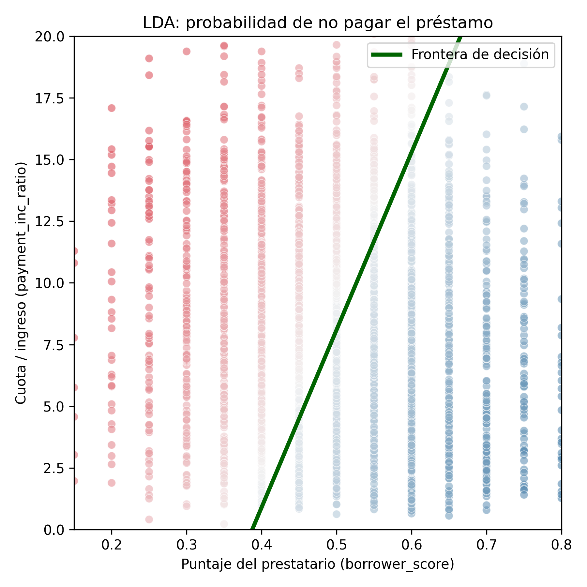

# 2.2 Análisis Discriminante

El análisis discriminante es uno de los métodos de clasificación más antiguos. Fue propuesto por el estadístico R. A. Fisher en 1936 para distinguir especies de plantas a partir de sus medidas. Hoy en día se usa menos que otros métodos más modernos, pero sigue siendo útil porque es simple, rápido y fácil de interpretar. La versión más usada es el **Análisis Discriminante Lineal**, conocido como **LDA** por sus siglas en inglés.

## Términos clave

- **Covarianza:** mide cuánto varía una variable junto con otra. Si es positiva, cuando una sube la otra también tiende a subir; si es negativa, cuando una sube la otra tiende a bajar.
- **Función discriminante:** es la fórmula que, aplicada a las variables predictoras, separa lo mejor posible a los grupos.
- **Pesos discriminantes:** son los valores que acompañan a cada variable dentro de la función discriminante. Con ellos se calcula la probabilidad de que un caso pertenezca a cada clase.

## 2.2.1 La matriz de covarianza

Para entender LDA primero hay que conocer la covarianza. Si tenemos dos variables, *x* y *z*, su covarianza se calcula así:

$$
s_{x,z} = \frac{\sum_{i=1}^{n} (x_i - \bar{x})(z_i - \bar{z})}{n - 1}
$$

Es parecida a la correlación, pero no está limitada entre −1 y 1: su valor depende de las unidades de las variables. Con las varianzas y la covarianza se arma la **matriz de covarianza**:

$$
\hat{\Sigma} = \begin{bmatrix} s_x^2 & s_{x,z} \\ s_{z,x} & s_z^2 \end{bmatrix}
$$

En la diagonal están las varianzas de cada variable y fuera de ella las covarianzas entre ambas. LDA usa esta matriz para tomar en cuenta cómo se relacionan las variables entre sí.

## 2.2.2 El discriminante lineal de Fisher

La idea de Fisher es sencilla. Queremos encontrar una combinación de las variables (por ejemplo, *a·x + b·z*) que haga que los dos grupos queden lo más separados posible. Para lograrlo, el método busca dos cosas al mismo tiempo:

- que la diferencia **entre** los grupos sea lo más grande posible, y
- que la variación **dentro** de cada grupo sea lo más pequeña posible.

Es decir, se busca maximizar el cociente:

$$
\frac{SS_{\text{entre}}}{SS_{\text{dentro}}}
$$

donde *SS* significa "suma de cuadrados". El resultado es una línea (o un plano, si hay más variables) que divide el espacio en dos zonas: los casos que caen de un lado se asignan a una clase y los del otro lado, a la otra.

Este método supone que las variables siguen una distribución normal y que los dos grupos tienen la misma matriz de covarianza. Aun así, suele funcionar bien aunque estos supuestos no se cumplan del todo.

## 2.2.3 Ejemplo práctico

Para el ejemplo se usa el conjunto de datos `loan3000` del libro, que contiene 3000 préstamos personales. La variable que queremos predecir es `outcome`, que indica si el préstamo fue pagado (`paid off`) o no fue pagado (`default`). Como predictores se usan dos variables:

- `borrower_score`: un puntaje entre 0 y 1 que indica qué tan confiable es el prestatario (de malo a excelente).
- `payment_inc_ratio`: la relación entre la cuota del préstamo y el ingreso de la persona. Mientras más alto, más pesa la cuota sobre sus ingresos.

En Python, el modelo se ajusta con `LinearDiscriminantAnalysis` de la librería scikit-learn. El código completo está en `codigo/2.2_lda.py`; la parte principal es esta:

```python
from sklearn.discriminant_analysis import LinearDiscriminantAnalysis

predictores = ['borrower_score', 'payment_inc_ratio']
X = loan3000[predictores]
y = loan3000['outcome']

loan_lda = LinearDiscriminantAnalysis()
loan_lda.fit(X, y)

loan_lda.scalings_          # pesos discriminantes
loan_lda.predict_proba(X)   # probabilidad de cada clase
```

### Resultados

Los pesos discriminantes obtenidos son:

| Variable | Peso |
|---|---|
| `borrower_score` | 7.1758 |
| `payment_inc_ratio` | −0.0997 |

Con estos pesos, el modelo calcula para cada préstamo la probabilidad de que no se pague. Por ejemplo, para los cinco primeros préstamos:

| Préstamo | P(no pagado) | P(pagado) |
|---|---|---|
| 1 | 0.5535 | 0.4465 |
| 2 | 0.5590 | 0.4410 |
| 3 | 0.2727 | 0.7273 |
| 4 | 0.5063 | 0.4937 |
| 5 | 0.6100 | 0.3900 |

Usando un punto de corte de 0.5, el préstamo 3 se clasifica como "pagado" y los demás como "no pagado". Estos valores coinciden con los que presenta el libro.

Al comparar las predicciones con lo que realmente ocurrió, el modelo acierta en el **62.9 %** de los casos:

| | Predicho: no pagado | Predicho: pagado |
|---|---|---|
| **Real: no pagado** | 852 | 593 |
| **Real: pagado** | 520 | 1035 |

### Gráfico de la frontera de decisión



*Figura 2.2. Predicción de LDA sobre el incumplimiento de préstamos usando el puntaje del prestatario y la relación cuota/ingreso. Elaboración propia con base en Bruce et al. (2020).*

Cada punto es un préstamo. El color indica la probabilidad de no pago calculada por el modelo: rojo para probabilidades altas y azul para probabilidades bajas. La línea verde es la frontera de decisión: los préstamos que quedan a la izquierda se predicen como "no pagado" (probabilidad mayor a 0.5) y los de la derecha como "pagado".

## 2.2.4 Interpretación

- **El puntaje del prestatario es la variable más influyente.** Su peso es positivo y grande, lo que indica que, a mayor puntaje, mayor es la probabilidad de que el préstamo se pague.
- **La relación cuota/ingreso tiene el efecto contrario.** Su peso es negativo: cuando la cuota pesa más en los ingresos, aumenta el riesgo de no pago.
- **La distancia a la línea indica la confianza.** Los puntos lejos de la frontera tienen probabilidades cercanas a 0 o a 1, por lo que el modelo está más seguro. Los puntos cerca de la línea tienen probabilidades cercanas a 0.5 y son los casos más dudosos.
- **LDA también sirve para elegir variables.** Si las variables se estandarizan antes de ajustar el modelo, los pesos indican cuáles son más importantes para separar a los grupos.

## 2.2.5 Extensiones

- **Más variables:** aunque el ejemplo usa solo dos, LDA funciona igual con muchas más. La única condición es tener suficientes registros para estimar la matriz de covarianza, algo que normalmente no es un problema en ciencia de datos.
- **Análisis Discriminante Cuadrático (QDA):** es la variante más conocida. La diferencia es que permite que cada grupo tenga su propia matriz de covarianza, en lugar de suponer que es la misma para los dos. En la práctica, la diferencia entre LDA y QDA no suele ser grande.

## Ventajas y limitaciones

| Ventajas | Limitaciones |
|---|---|
| Es rápido y fácil de calcular. | Supone que los datos son normales y que los grupos tienen la misma covarianza. |
| Sus resultados son fáciles de interpretar. | Solo traza fronteras rectas, por lo que no capta relaciones más complejas. |
| Entrega probabilidades, no solo etiquetas. | Es sensible a los valores atípicos. |
| Sirve para seleccionar variables y reducir dimensiones. | Necesita suficientes registros por cada variable. |
| Funciona con dos o más clases. | Suele ser superado por métodos más modernos en problemas complejos. |

## Aplicaciones

- **Banca:** clasificar solicitantes de crédito según su riesgo, como en el ejemplo.
- **Biología:** clasificar especies según sus medidas, como en el estudio original de Fisher con las flores *iris*.
- **Medicina:** distinguir pacientes sanos y enfermos a partir de resultados de laboratorio.
- **Marketing:** separar clientes en grupos según su comportamiento de compra.

## Ideas clave

- El análisis discriminante funciona con predictores continuos o categóricos y con una respuesta categórica.
- Usa la matriz de covarianza para calcular una función discriminante lineal que separa a los registros de una clase de los de la otra.
- Esa función asigna a cada registro una puntuación por clase, y con ella se decide a qué clase pertenece.
